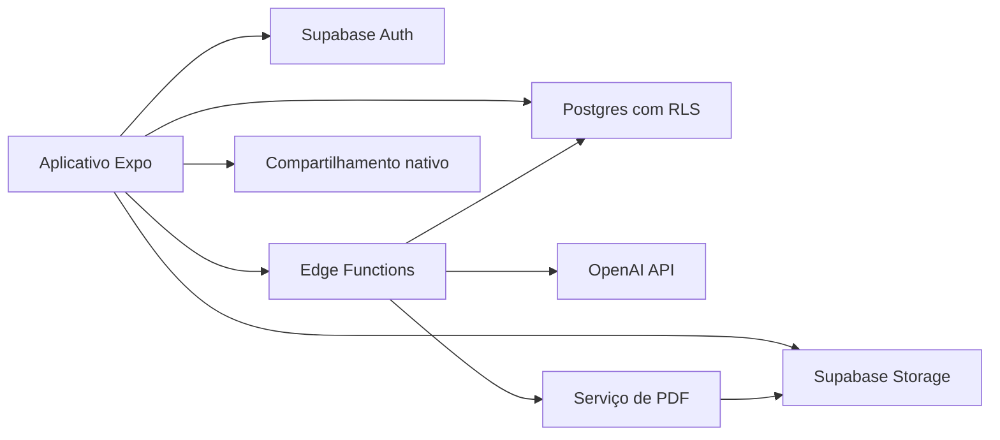

# Arquitetura - OrçaAI

## 1. Decisão recomendada

Construir um aplicativo React Native com Expo e TypeScript, usando Supabase como
backend gerenciado e OpenAI para interpretação estruturada.

Essa combinação reduz o trabalho inicial de infraestrutura, mantém Postgres como
fonte de verdade e permite lançar Android e iOS a partir de uma base de código.

## 2. Componentes



### Aplicativo

- Expo Router para navegação.
- TypeScript.
- TanStack Query para estado remoto e cache.
- React Hook Form com Zod para formulários.
- `expo-secure-store` para material sensível da sessão.
- API nativa de compartilhamento para enviar o PDF.

### Backend

- Supabase Auth para autenticação.
- PostgreSQL para dados relacionais.
- Row Level Security para isolamento por empresa.
- Supabase Storage para logotipos, anexos e PDFs.
- Edge Functions para IA, emissão, webhooks e operações privilegiadas.

### IA

- OpenAI Responses API.
- Structured Outputs com JSON Schema estrito.
- Prompt versionado.
- Validação adicional com Zod no backend.
- Modelo configurável por ambiente, sem acoplar regras ao nome de um modelo.

### PDF

Opção recomendada para produção: template HTML/CSS renderizado no backend por um
serviço pequeno com navegador headless. Isso facilita paginação, tipografia e
evolução visual.

Alternativa para protótipo: gerar no próprio app com uma biblioteca do Expo. É
mais rápido para provar o fluxo, mas pode variar entre plataformas e dificulta
versionamento idêntico.

Decisão prática:

- protótipo: PDF local;
- beta/produção: snapshot imutável e renderização no backend.

## 3. Por que Expo em vez de Flutter

Ambos atendem ao produto. Expo é a recomendação porque:

- TypeScript pode ser compartilhado entre app, schemas e funções;
- ecossistema forte para atualização, build e distribuição;
- integração direta com bibliotecas web e Supabase;
- menor quantidade de linguagens no início.

Flutter seria uma boa escolha se a equipe já dominasse Dart ou exigisse controle
visual muito específico. Não há requisito atual que compense essa troca.

Uma PWA não deve ser a experiência principal: compartilhamento e arquivos são
possíveis, mas instalação, notificações e comportamento em Android variam mais.
Ela pode surgir depois como painel administrativo.

## 4. Fluxo de interpretação

1. App salva um rascunho com o texto original.
2. App chama `interpret-quote` com o ID do rascunho.
3. Função verifica usuário, empresa, limite e idempotency key.
4. Função remove metadados desnecessários e chama a OpenAI.
5. Modelo retorna JSON aderente ao schema.
6. Backend valida schema e regras semânticas.
7. Backend salva a interpretação, versão do prompt/modelo e uso.
8. App exibe uma comparação entre original e estrutura.
9. Usuário responde às dúvidas ou edita campos.
10. App marca a interpretação como confirmada.

### Schema conceitual da IA

```json
{
  "schema_version": "1.1",
  "customer": {
    "name": null,
    "phone": null,
    "address": null
  },
  "items": [
    {
      "type": "service",
      "description": "Pintura quartos (3)",
      "category": "Área interna",
      "quantity": 3,
      "unit": "quartos",
      "unit_price_cents": 60000,
      "source_excerpt": "e dos 3 quartos (600 reais)",
      "confidence": "high"
    }
  ],
  "commercial_terms": {
    "discount": null,
    "payment_terms": null,
    "estimated_duration_days": null,
    "validity_days": null
  },
  "questions": [],
  "warnings": []
}
```

Campos monetários podem ser extraídos quando explícitos, mas são validados e
recalculados fora do modelo. `null` é sempre preferível a uma suposição.

## 5. Estratégia de prompt

O prompt deve:

- definir a função como extrator, não consultor de preços;
- usar português brasileiro;
- preservar escopo e exclusões;
- diferenciar cliente, endereço do cliente e local do serviço;
- reconhecer formatos como `2.800`, `2800 reais` e `R$ 2.800,00`;
- distinguir quantidade física de quantidade de ambientes;
- retornar `null` quando não houver evidência;
- apontar conflitos sem escolher silenciosamente;
- formular no máximo três perguntas por rodada;
- não corrigir o sentido comercial ao corrigir a escrita.

Não enviar catálogo, histórico completo ou outros clientes sem necessidade. A
entrada deve ser limitada em tamanho e protegida contra instruções presentes no
texto do usuário.

## 6. Modelo de dados inicial

### `profiles`

- `id` UUID, relacionado a `auth.users`;
- `full_name`;
- `phone`;
- timestamps.

### `organizations`

- `id`;
- `owner_user_id`;
- `trade_name`;
- `legal_name`;
- `tax_id`;
- contatos e endereço;
- `logo_path`;
- preferências e padrões;
- timestamps.

Mesmo no plano individual, usar organização evita migração estrutural quando
equipes forem adicionadas.

### `organization_members`

- `organization_id`;
- `user_id`;
- `role`;
- status.

### `customers`

- `id`;
- `organization_id`;
- nome, telefone, e-mail e documento;
- endereço;
- `notes`;
- `archived_at`;
- timestamps.

### `quotes`

- `id`;
- `organization_id`;
- `customer_id`;
- `number`;
- `status`;
- `source_text`;
- local do serviço;
- datas de emissão e validade;
- desconto;
- totais em centavos;
- termos comerciais;
- `current_version`;
- timestamps.

### `quote_items`

- `id`;
- `quote_id`;
- `position`;
- `type`;
- descrição;
- categoria (texto livre, rótulo de agrupamento do próprio texto original);
- quantidade decimal;
- unidade;
- valor unitário e total em centavos;
- observações.

### `quote_versions`

- `id`;
- `quote_id`;
- `version`;
- snapshot JSON completo;
- caminho do PDF;
- hash do snapshot;
- `issued_at`;
- `created_by`.

### `ai_interpretations`

- `id`;
- `quote_id`;
- status;
- texto de entrada ou referência protegida;
- resultado JSON;
- prompt/schema/model version;
- campos incertos;
- tokens/uso e custo estimado;
- erro sanitizado;
- timestamps.

### `quote_events`

- `id`;
- `quote_id`;
- tipo do evento;
- ator;
- metadados mínimos;
- timestamp.

## 7. Endpoints/funções

- `interpret-quote`: interpreta texto e grava resultado.
- `apply-interpretation`: aplica resultado confirmado ao rascunho.
- `issue-quote`: valida, numera, cria snapshot e solicita PDF.
- `regenerate-quote-pdf`: reprocessa o mesmo snapshot, sem alterar conteúdo.
- `delete-account`: agenda exclusão e revoga acesso.

CRUD simples de clientes e rascunhos pode usar a API do Supabase protegida por
RLS. Operações que envolvem segredo, numeração, IA ou emissão passam por função.

## 8. Numeração e concorrência

Manter contador por organização e ano. A emissão chama uma função transacional
no Postgres que incrementa e retorna o próximo número. Exemplo visual:
`2026-0042`.

O número não deve ser reservado ao criar rascunho; isso evita buracos causados
por rascunhos abandonados.

## 9. Segurança e LGPD

- Definir a empresa usuária como controladora e os provedores como operadores,
  conforme contratos e fluxo real.
- Publicar política de privacidade e termos em linguagem clara.
- Identificar base legal adequada para dados do prestador e dos clientes.
- Coletar somente dados necessários.
- Separar consentimento de analytics/marketing da execução do serviço.
- Oferecer correção, exportação e exclusão.
- Definir retenção para conta excluída, logs e PDFs.
- Assinar e revisar DPAs dos fornecedores antes do uso comercial.
- Manter segredos apenas no backend.
- Usar RLS em todas as tabelas multiempresa.
- Usar buckets privados e URLs assinadas para PDFs.
- Não registrar conteúdo integral em analytics ou rastreamento de erros.
- Aplicar rate limit por usuário e organização.
- Registrar eventos críticos sem expor conteúdo pessoal.
- Criar plano de resposta a incidentes.

Documentos de clientes podem ser opcionais e evitados no MVP se não forem
necessários para o orçamento. Menos coleta reduz risco.

## 10. Disponibilidade e modo offline

O MVP exige internet para interpretar e emitir. Para não perder trabalho:

- texto em edição é salvo localmente;
- rascunhos podem ser preparados sem IA;
- fila de sincronização tenta novamente quando a conexão voltar;
- interface deixa claro quando o conteúdo ainda não foi sincronizado.

Offline completo adicionaria resolução de conflitos, armazenamento seguro e
sincronização complexa; não é necessário para testar a proposta.

## 11. Observabilidade

Medir:

- latência e falha por função;
- falha de schema da IA;
- custo estimado por interpretação;
- geração de PDF;
- funil de criação;
- correções feitas após IA;
- versões do prompt e schema.

Sentry deve receber IDs técnicos e contexto sanitizado. Analytics não deve
receber nomes, telefones, endereços, texto original ou conteúdo dos itens.

## 12. Testes

### Unidade

- dinheiro e arredondamento;
- descontos;
- datas e validade;
- normalização de quantidade;
- validação do schema;
- estados permitidos.

### Integração

- RLS por organização;
- numeração concorrente;
- idempotência;
- snapshot e PDF;
- falha/retry de IA.

### Avaliação da IA

- dataset anonimizado e versionado;
- casos de pintura, elétrica, hidráulica e serviços gerais;
- preços em formatos diferentes;
- mensagens incompletas e contraditórias;
- prompt injection dentro da descrição;
- métrica por campo e taxa de invenção.

### Ponta a ponta

- cadastro até compartilhamento;
- edição manual sem IA;
- perda e retorno de conexão;
- reemissão como nova versão;
- exclusão da conta.

## 13. Custos iniciais

Valores são referências em dólares, consultadas em junho de 2026, e devem ser
revistos antes da contratação.

### Desenvolvimento/protótipo

- Expo: possível iniciar gratuitamente.
- Supabase Free: suficiente para protótipo e testes limitados.
- OpenAI: variável por uso; tende a ser baixo para mensagens curtas, mas precisa
  de telemetria desde o primeiro teste.
- Lojas: taxas das contas de desenvolvedor não estão incluídas nesta estimativa.

### Produção pequena

- Supabase Pro: a partir de US$ 25/mês.
- IA: orçamento controlado por limite de uso e alertas.
- Monitoramento: camada gratuita inicialmente, conforme limites vigentes.
- Renderização de PDF: pode usar serviço serverless ou pequeno container; custo
  depende do volume e do provedor.

O custo unitário deve ser calculado com dados reais:

```text
custo mensal total / quantidade de orçamentos emitidos
```

Definir limite de gastos, alertas e bloqueio gracioso antes de abrir cadastro
público.

## 14. Fontes técnicas

- [Expo Documentation](https://docs.expo.dev/)
- [Supabase Documentation](https://supabase.com/docs/)
- [Supabase Pricing](https://supabase.com/pricing)
- [OpenAI Structured Outputs](https://platform.openai.com/docs/guides/structured-outputs)
- [OpenAI Audio](https://platform.openai.com/docs/guides/audio)
- [OpenAI API Pricing](https://openai.com/api/pricing/)
- [ANPD](https://www.gov.br/anpd/pt-br)

